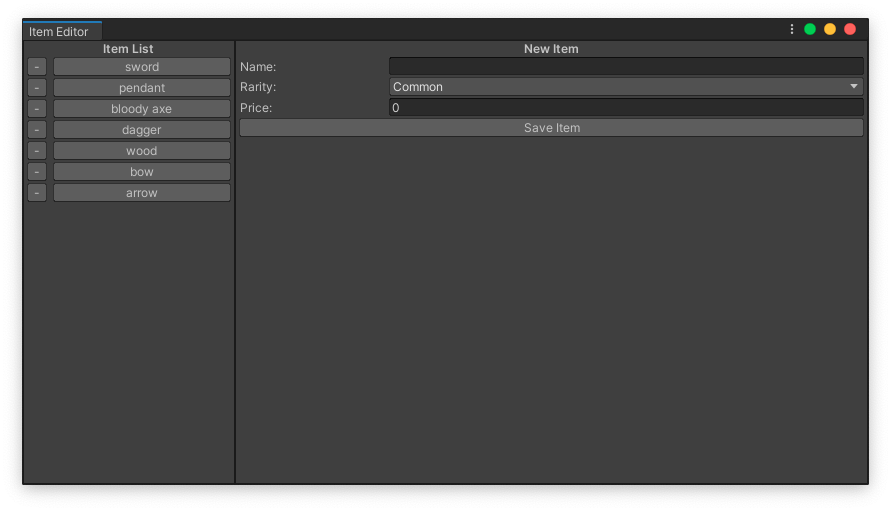

This is a sample project for UIElements. 
I wanted to play and explore the new api and made a little item editor tool.
It saves and loads from `Resources` folder.

You can open the window from `Tools/Item Editor`.

